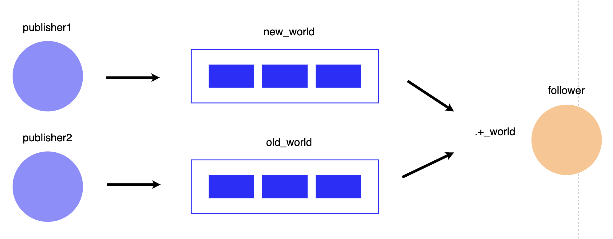
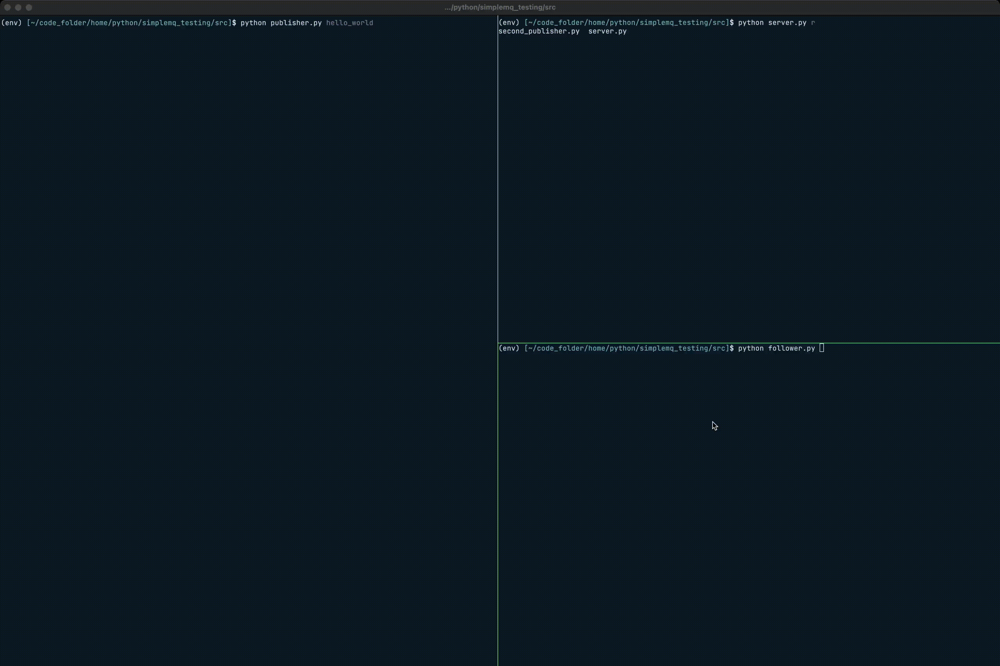

# SimpleMQ

_SimpleMQ_ - простой _MQ_, написанный на питоне с использованием стримов из библиотеки **asyncio** для написания сервера
и сокетов из библиотеки **socket** для реализации постоянного соединения сервер-подписчик

## Setup

`pip install asyncio-simple-mq`

## Get Started

1. [Hello world](#hello_world)
2. [Worker](#worker)
3. [Routing](#routing)

## <a name="hello_world">Hello world</a>

**Publisher** (_Издатель_) - отсылает сообщение на сервер
**Stream** (_Стрим_) - Некоторое отдельное пространство для хранения сообщений. Сообщения могут храниться только внутри стримов, но при этом на сервере может быть создано множество стримов. Издатель отправляет сообщение в стрим. Подписчик в свою очередь пытается получить сообщение из стрима.
**Follower** (_Подписчик_) - устанавливает постоянное _TCP_ соединение с сервером и ждет пока в стриме появятся сообщения

В **hello world** примере мы рассмотрим только одного издателя, один стрим и одного подписчика


1. Создаем конфигурационный файл **settings.yaml** с данными для запуска сервера, удобнее его положить рядом с _server.py_, который мы создадим далее

```yaml
host:
port:

# пример
host: localhost
port: 9090
```

2. Создаем server.py

```python
# server.py

from simplemq.server.server import run_server

if __name__ == '__main__':
    run_server(settings_yml_filepath='settings.yaml')

```

3. Создаем **follower.py**

```python
# follower.py

from simplemq.follower import Follower
from simplemq.bind import Bind
from simplemq.connection import Connection, ConnectionConfig

connection_config = ConnectionConfig(
    host='localhost',
    port=9090,
)

connection = Connection(connection_config=connection_config)

bind = Bind(route_string='hello_queue')
follower = Follower(connection=connection, bind=bind)

cursor = connection.cursor()
with cursor.session():
    cursor.create_stream('hello_queue')


def handle_message(message):
    from time import sleep
    sleep(5)
    print('message_body: ', message.message_body)
    print('message_handled')


with follower.session():
    for message in follower.get_messages():
        handle_message(message=message)
        follower.ack_message(message)

```

4. Создаем **publisher.py**

```python
# publisher.py

from simplemq.publisher.publisher import SocketBasedPublisher
from simplemq.bind import Bind
from simplemq.connection import Connection, ConnectionConfig

connection_config = ConnectionConfig(
    host='localhost',
    port=9090,
)

connection = Connection(connection_config=connection_config)

MESSAGE_BODY = 'hello world'

bind = Bind(route_string='hello_queue')
cursor = connection.cursor()
with cursor.session():
    cursor.create_stream('hello_queue')

publisher = SocketBasedPublisher(connection=connection, bind=bind)
publisher.send_message(message_body=MESSAGE_BODY)

```

Тут появляются новые определения:

1. **Bind** - являются роутером, то есть - в случае с издателем говорит в очередь с каким наименованием (значение аргумента _routing_string_) отправлять сообщение, в случае подписчика - из какой очереди ждать сообщения.
2. **Cursor** - объект, который не участвует в обмене сообщениями, он нужен для утилити функций: создать стрим; посмотреть все стримы, которые есть на сервере и тд.

**Демонстрация работы:**


В этом примере мы сначала подключили подписчика, а только потом начали отправлять сообщения в стрим издателем. Мы также можем сначала заполнить стрим сообщениями и только потом включить подписчика, в таком случае он сразу получить сообщения, а не будет их ждать.

**Потверждение сообщений**
Когда подписчик читает сообщение со стрима оно удаляется со стрима и переходит в _PEL_ (Pending entry list). После **ACK** сообщения от подписчика об обработке этого сообщения оно исчезает и от туда.
Есть 2 способа потвердить обработку сообщения:

- самому, вызвав у инстанса Follower метод **ack_message**

```python
with follower.session():
    for message in follower.get_messages():
        handle_message(message=message)
        follower.ack_message(message)
```

- передать True в аргумент auto_ack. В таком случае на сервер придет потверждение об обработке сообщения еще до вызова _handle_message_

```python
with follower.session():
    for message in follower.get_messages(auto_ack=True):
        handle_message(message=message)
```

## <a name="worker">Worker</a>


Подписчики являются воркерами. При чтении сообщения подписчиком это сообщение пропадает из стрима, поэтому второй подписчик, который подписан на тот же стрим его не прочитает. Запустим двух подписчиков, только один из них будет обрабывать сообщение 100 секунд, а второй 2. Пока первый подписчик обработывает сообщение (в нашем случае просто спит) второй подписчик может читать входящие сообщения.

```python
# first_follower.py

from simplemq.follower import Follower
from simplemq.bind import Bind
from simplemq.connection import Connection, ConnectionConfig

connection_config = ConnectionConfig(
    host='localhost',
    port=9090,
)

connection = Connection(connection_config=connection_config)

bind = Bind(route_string='hello_queue')
follower = Follower(connection=connection, bind=bind)

cursor = connection.cursor()
with cursor.session():
    cursor.create_stream('hello_queue')


def handle_message(message):
    from time import sleep
    sleep(100)
    print('message_body: ', message.message_body)
    print('message_handled')


with follower.session():
    for message in follower.get_messages():
        handle_message(message=message)
        follower.ack_message(message)

```

```python
# second_follower.py

from simplemq.follower import Follower
from simplemq.bind import Bind
from simplemq.connection import Connection, ConnectionConfig

connection_config = ConnectionConfig(
    host='localhost',
    port=9090,
)

connection = Connection(connection_config=connection_config)

bind = Bind(route_string='hello_queue')
follower = Follower(connection=connection, bind=bind)

cursor = connection.cursor()
with cursor.session():
    cursor.create_stream('hello_queue')


def handle_message(message):
    from time import sleep
    sleep(2)
    print('message_body: ', message.message_body)
    print('message_handled')


with follower.session():
    for message in follower.get_messages():
        handle_message(message=message)
        follower.ack_message(message)
```

**Демонстрация работы:**


## <a name="routing">Routing</a>

У **Bind** есть два режима роутинга:

- _Direct_ - режим по умолчанию, который мы использовали раньше. Издатель отправляет сообщения в стрим с наименованием равным значению аргумента _routing_key_. Подписчик читает сообщения из стрима с наименованием равным значению аргумента _routing_key_.
- _REGEX_BASED_ - Издатель отправляет сообщения во все стримы, название которых удовлетворяет regex выражению из _routing_key_. Подписчик читает сообщения из всех стримов, название которых содержит удовлетворяет regex выражению из _routing_key_.

1. RegexBased Routing cо стороны издателя
   

```python
# publisher

from simplemq.publisher.publisher import SocketBasedPublisher
from simplemq.bind import Bind, BindTypes
from simplemq.connection import Connection, ConnectionConfig

connection_config = ConnectionConfig(
    host='localhost',
    port=9090,
)

connection = Connection(connection_config=connection_config)

message_body = 'hello world'

bind = Bind(route_string='.+_world', bind_type=BindTypes.REGEX_BASED)
cursor = connection.cursor()
with cursor.session():
    cursor.create_stream('hello_queue')

publisher = SocketBasedPublisher(connection=connection, bind=bind)
publisher.send_message(message_body=message_body)

```

```python
# first_follower.py

from simplemq.follower import Follower
from simplemq.bind import Bind
from simplemq.connection import Connection, ConnectionConfig

connection_config = ConnectionConfig(
    host='localhost',
    port=9090,
)

connection = Connection(connection_config=connection_config)

bind = Bind(route_string='new_world')
follower = Follower(connection=connection, bind=bind)

cursor = connection.cursor()
with cursor.session():
    cursor.create_stream('new_world')


def handle_message(message):
    from time import sleep
    sleep(3)
    print('message_body: ', message.message_body)
    print('message_handled')


with follower.session():
    for message in follower.get_messages():
        handle_message(message=message)
        follower.ack_message(message)

```

```python
# second_follower.py

from simplemq.follower import Follower
from simplemq.bind import Bind
from simplemq.connection import Connection, ConnectionConfig

connection_config = ConnectionConfig(
    host='localhost',
    port=9090,
)

connection = Connection(connection_config=connection_config)

bind = Bind(route_string='old_world')
follower = Follower(connection=connection, bind=bind)

cursor = connection.cursor()
with cursor.session():
    cursor.create_stream('old_world')


def handle_message(message):
    from time import sleep
    sleep(3)
    print('message_body: ', message.message_body)
    print('message_handled')


with follower.session():
    for message in follower.get_messages():
        handle_message(message=message)
        follower.ack_message(message)
```

**Демонстрация работы:**


2. RegexBased Routing cо стороны подписчика
   

```python
# first_publisher.py

from simplemq.publisher.publisher import SocketBasedPublisher
from simplemq.bind import Bind
from simplemq.connection import Connection, ConnectionConfig

connection_config = ConnectionConfig(
    host='localhost',
    port=9090,
)

connection = Connection(connection_config=connection_config)

message_body = 'hello world'

bind = Bind(route_string='old_world')
cursor = connection.cursor()
with cursor.session():
    cursor.create_stream('old_world')

publisher = SocketBasedPublisher(connection=connection, bind=bind)
publisher.send_message(message_body=message_body)

```

```python
# second_publisher.py

from simplemq.publisher.publisher import SocketBasedPublisher
from simplemq.bind import Bind
from simplemq.connection import Connection, ConnectionConfig

connection_config = ConnectionConfig(
    host='localhost',
    port=9090,
)

connection = Connection(connection_config=connection_config)

message_body = 'hello world'

bind = Bind(route_string='new_world')
cursor = connection.cursor()
with cursor.session():
    cursor.create_stream('new_world')

publisher = SocketBasedPublisher(connection=connection, bind=bind)
publisher.send_message(message_body=message_body)

```

```python
# follower

from simplemq.follower import Follower
from simplemq.bind import Bind, BindTypes
from simplemq.connection import Connection, ConnectionConfig

connection_config = ConnectionConfig(
    host='localhost',
    port=9090,
)

connection = Connection(connection_config=connection_config)

bind = Bind(route_string='.+world', bind_type=BindTypes.REGEX_BASED)
follower = Follower(connection=connection, bind=bind)


def handle_message(message):
    from time import sleep
    sleep(3)
    print('message_body: ', message.message_body)
    print('message_handled')


with follower.session():
    for message in follower.get_messages():
        handle_message(message=message)
        follower.ack_message(message)

```

**Демонстрация работы:**

